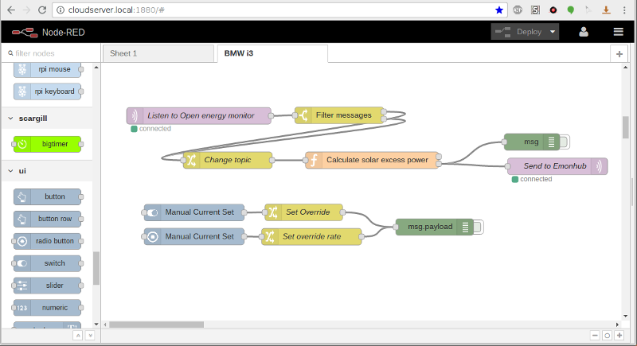
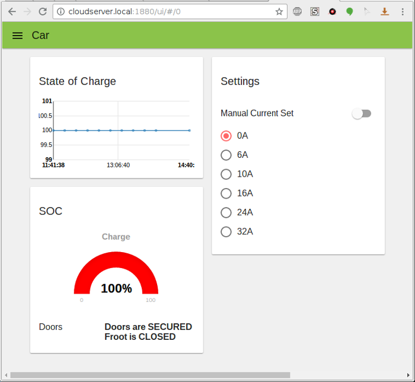

# Example Node Red flow
In this file is an example flow for Node Red to control a Solar EVSE unit based on available solar power.
To use the flow copy to clipboard and then import into Node Red. 
## Required Nodes
 This example flow makes use of the [node-red-contrib-ui](https://flows.nodered.org/node/node-red-contrib-ui) node to create a simple user interface to override Open Energy Monitor,
 and set a fixed rate of charge to the vehicle.  In this screenshot are also visible a chart and dial showing vehicle state of charge, These items are not included in
 this flow, and are a separate project.
## Data format
This flow assumes that OpenEnergy Monitor has been configured to provide MQTT messages with the following topics.
* **SMASolar/ACOutputPhase1** - This topic has a payload of output from the solar panels in W. In my system I can read this figure directly from my SMA inverter via a python
 script and Bluetooth.
* **emon/solar_EVSE/car_power** - This topic has a payload of the power being consumed by the car in W.  In my system I derive it from a current sensing transformer
 attached to the EVSE power supply.
* **emon/solar_EVSE/house_power** - This topic has a payload of the total power being consumed in the house, including that consumed by the car.

The flow produces a single output with the topic **emonhub/tx/24/values** which represents the Voltage the Arduino based Solar_EVSE unit should 
 signal to the Viridian EPC. The stanza shown in the emonhub folder should be added to the emonhub.conf file so that emonhub knows what to do with the MQTT message,
 and the patch **EmonHubJeeInterfacer.patch** in the emonhub folder should be applied to emonhub so it can send packets to  remote nodes.
Be aware emonhub is very fussy about receiving properly formatted MQTT packets.  It will crash if it receives a malformed packet.